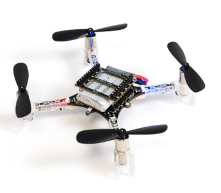

# Exploring the CrazyFlie

The CrazyFlie 2.1 is a small indoor drone built by BitCraze. Both its hardware and software are open, it's created with development in mind and is easily
extendable. This page documents how to assemble the drone and prepare it for this project.



To recap, for this project a drone is needed that:
1. Knows its position in a room
2. Can measure at several such positions the strength of different WiFi signals

The former will be achieved by using the CrazyFlie's Loco Positioning System (LPS) that works with anchor stations distributed over the room and an expansion deck
on the drone that will allow it to calculate its position using the signals it receives from the anchors.

The latter will be done by mounting and integrating an ESP2866 WiFi module on the CrazyFlie.

## Assembly and base connectivity
Follow instructions in the [getting started guide](https://www.bitcraze.io/documentation/tutorials/getting-started-with-crazyflie-2-x/) on assembly. Do a self test when finished. When self-test is succesful, install android/iphone app to connect over bluetooth and check connectivity. Do a test flight using the app.

## Computer connectivity
### Setup the CrazyRadio & Controller
1. Set [udev permissions](https://github.com/bitcraze/crazyflie-lib-python#setting-udev-permissions) so we can work with the CrazyRadio without requiring root privileges
2. Connect the CrazyRadio to a free USB port
3. Connect PS3 Controller to a free USB port


### Install the CrazyFlie client from source on Linux
Installation on Linux (Debian Buster)
1. Clone CrazyFlie client repository (https://github.com/bitcraze/crazyflie-clients-python)
2. Setup a virtual environment
3. Install PyQT5, mind version in requirements.txt to avoid errrors
4. Install CF Client in development mode:
```pip install -e crazyflie-clients-python```
5. Run the client by executing the cfclient python script
```python crazyflie-clients-python/bin/cfclient```
6. Follow instructions in the getting started guide to update the CrazyFlie firmware
7. Calibrate the PS3 controller by creating a new configuration (if necessary)

### Installing the loco positioning deck
Simply mount the deck at the bottom of the CrazyFlie. The deck's firmware was included in the firmware update already done.


## Preparing the loco positioning anchors
### Installing the LPS tools
See also [Preparing the anchors](https://www.bitcraze.io/documentation/tutorials/getting-started-with-loco-positioning-system/)
1. git clone the LPS tools repo: https://github.com/bitcraze/lps-tools
2. From the same virtual environment used for the CrazyFlie client, install the LPS tools in development mode:
```pip install -e lps-tools/```
3. Set [udev permissions](https://github.com/bitcraze/lps-tools#usb-access-right-on-linux)

Reload the rules by doing:
```
sudo udevadm control --reload-rules
sudo udevadm trigger
```
4. To configure anchors as non root, add yourself to the `dialout` group
```usermod -aG dialout <username>```
5. Run the LPS tools by executing the module:
```python3 -m lpstools```

### Flashing & Configuring the anchors
With the LPS tools running and for all 8 anchors:
1. Connect an anchor over USB while holding the DFU button
2. Use the tools to flash the firmware (used `lps-node-firmware-2019.09.dfu`)
3. Configure the node by giving it an ID and setting its mode to `Anchor (TWR)`

### Positioning the anchors
For good results:
- Spread evenly and at least 2m apart over flying volume
- Anchors should have line-of-sight with flying volume
- Antennas should be placed 15cm from any wall to avoid interference of reflections
Would be great to have 8 to 10 [3D printed mounts](https://github.com/bitcraze/bitcraze-mechanics/blob/master/LPS-anchor-stand/anchor-stand.stl)


## Preparing the development environment
### Installing CrazyFlie APIs
1. git clone the API repo: git@github.com:bitcraze/crazyflie-lib-python.git
2. install the API libs in development mode: `pip install -e crazyflie-lib-python`
3. the virtual environment should now hold the required libraries to start development using the API
