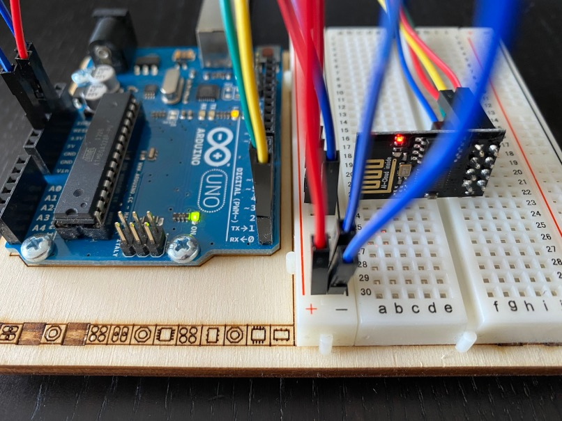

# Exploring the ESP8266 WiFi module
The ESP8266 module is a small, light-weight and cheap WiFi module based on the ESP8266 chip by Espressif systems. It
features a full TCP/IP stack and micro controller. It can be addressed over a serial interface and requires 3.3V. The
CrazyFlie can provide 3V which should be sufficient in this case.


For this project the ESP-01s version of the ESP8266 module is used, it has 1MB flash and a built-in (PCB) antenna.

## Getting to know the ESP8266 module
Integrating the ESP8266 module in the CrazyFlie is a complex undertaking when unfamiliar with (these) electronics. It
therefore makes sense to get to know the module a bit and understand how to communicate with it outside of the 
CrazyFlie system. To accomplish that, an Arduino Uno was used to power the ESP8266 and provide a serial passthrough
interface so that a PC to ESP8266 serial interface can be set up.

How to connect an Arduino Uno to an ESP8266 can be found online, here [the instructions](https://create.arduino.cc/projecthub/PatelDarshil/how-to-communicate-with-esp8266-via-arduino-uno-f6e92f)
from Patel Darshil on arduino.cc were used to create the setup below:



The following connectins were made
- Arduino `GND` and `RESET` to ESP8266 `GND`
- Arduino `3.3v` to ESP8266 `VCC` and `CH_PD` (`CH_PD` is the chip powerdown pin, chip will sleep if pin not high) 
- Arduino `RX` to ESP8266 `RX` (pass-through)
- Aruidno `TX` to ESP8266 `TX` (pass-through)

After connecting the Arduino to a PC the red LED on the ESP8266 should turn on. Serial communication with the ESP8266 
is now possible by using the relevant TTY device (check `dmesg`) with a baud rate of 115200, 8N1. The arduino IDE's
Serial Monitor can be easily used for this but `minicom` and `screen` work as well, just remember to send a carriage
return `\r` and newline `\n` after each command.

## Talking to the ESP8266
Now that communication with the ESP8266 module is possible, it's time to look at what commands are useful and
relevant in our context. In short, what is required is to be able to initialize the module, scan the WiFi channels
and get a list of access point (SSID, MAC address) and their signal strength (RSSI). The 4 selected AT commands below
should suffice for this purpose.

### Relevant AT commands
Input and output below is indicated with an `I>` and `O>` respectively.

**Test the connection and readiness of the module:**
```
I> AT
O> OK
```

**Set the module's WiFi mode to *station*: (1=station, 2=soft-ap, 3=soft-ap+station)**
```
I> AT+CWMODE=1
O> OK
```

**Set the expected output of a scan:**

Since we are only interested in the `<SSID, RSSI, MAC>` tuple, we limit the output to just those by setting the 2nd,
3rd and 4th bit. (2+4+8)
```
I> AT+CWLAPOPT=0,14
O> OK
```

**Perform a scan over all 802.11g bands**

This takes about 2 seconds to complete. For privacy reasons, the sample below is limited to public access points with
data anonymised.
```
I> AT+CWLAP
O> +CWLAP:(0,"TelenetWiFree",-53,"06:35:3b:00:00:00",1,-9,0)
O> +CWLAP:(0,"TelenetWiFree",-87,"36:2c:b4:00:00:00",1,21,0)
... snip ...
O> +CWLAP:(5,"Proximus Public Wi-Fi",-85,"3a:35:fb:00:00:00",6,10,0)
O> +CWLAP:(0,"TelenetWiFree",-80,"36:2c:b4:00:00:00",11,0,0)
```
