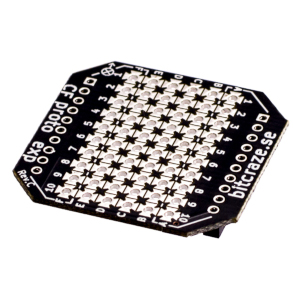
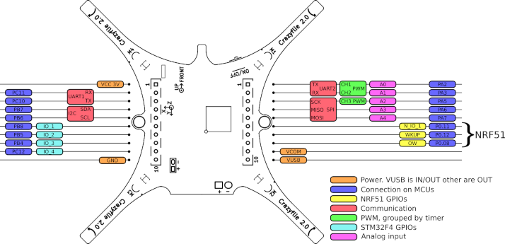
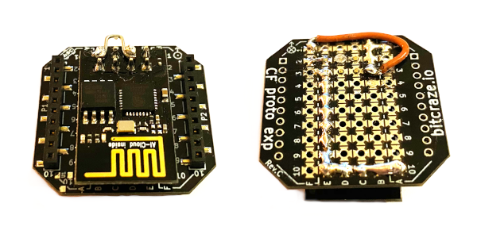

# Mounting the ESP8266 on the CrazyFLie

## Prototyping deck
Now that the necessary commands for the ESP8266 have been tested, it's time to get it
connected to the CrazyFlie. BitCraze provides a prototyping deck to make connecting your
own electronics to the drone easier. It's a small expansion board that gives easy access to
the pins of the CrazyFlie.

The 2x 10 holes on the sides of the prototyping deck connect to the pins of the CrazyFlie,
making them available on the soldering pads of rows A and F. 

## Determining the correct pins
As discovered while [exploring the ESP8266](exploring_esp8266.md), the ESP8266 needs
to make the following connections to the drone:
- A 3.3v input to the module's `VCC` and `CH_PD` pins
- Grounding to its `GND` pin
- UART interface for its `RX` and `TX` pins

To see what the CrazyFlie offers on its expansion port, we use the corresponding scheme from
[BitCraze's wiki page](https://wiki.bitcraze.io/projects:crazyflie2:expansionboards:index) 

Note that this matches the pins and soldering pads on the prototyping deck. The row of pins
on the left side is identified as `P1`, the ones on the right side as `P2`. Knowing this pin
layout, we plan the following approach for getting everything connected:
- CF P1.1 `VCC 3V` to ESP `VCC`
- Bridge ESP `VCC` and `CH_PD` pins
- CF P1.10 `GND` to ESP `GND`
- CF P2.1 `UART2 TX` to ESP `RX`
- CF P2.1 `UART2 RX` to ESP `TX`

Some remarks regarding these connections:
- We saw that the ESP8266 expects 3.3V while the CrazyFlie lists 3V, according to their
website:
    > The Crazyflie 2.0 is a 3.0V system, meaning a high output will be 3.0V 
    > but still compatible with a 3.3V system.
- We use the 2nd serial interface `UART2` as `UART1` is already used by our other expansion
board: the _Loco Positioning Deck_. Which pins are used by what expansion board can be found
on the same wiki page, in the [Deck Pin Allocation table](https://wiki.bitcraze.io/projects:crazyflie2:expansionboards:index#deck_pin_allocation).

## Soldering the ESP8266 to the prototyping board
Knowing now how everything should be connected, we can proceed by soldering the ESP8266
to the prototyping board according to the pin layout above. It's important to keep in mind
that when the prototyping deck with the wifi module gets eventually mounted, there is little
spare room. It's therefore interesting to bridge the available soldering pads as much as 
possible so that the amount of cables can be limited.

The finished prototyping deck with the ESP8266 module soldered to it below, top and bottom view:

